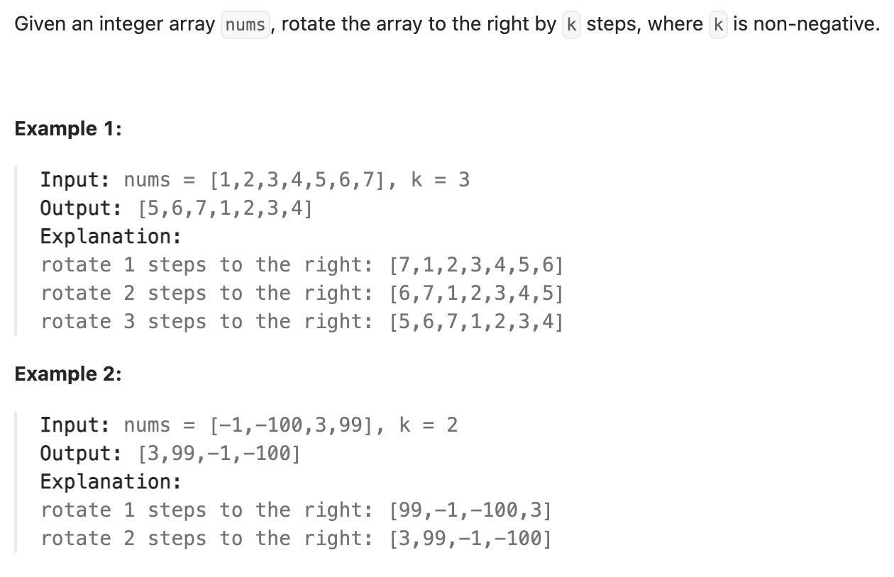

# Description


# Solution
We can use three ways to solve the problem.

## Solution 0
Use an extra array to store the result.

```c++
newArray[i + k] = nums[i];
```

**Note**: We can use $nums.assign()$ to store the result in $nums$.

```
nums.assign(newArray.begin(), newArray.end());
```

## Solution 1

Use some mathematical ways to make problem easy. We can modify the original array $nums$ to store the result without extra space overhead.

Assuming we start at $nums[0]$, and after $x$ iterations, we return $nums[0]$. And $x < n $(easy to confirm).

So if $gcd(n, k) == 1$, then by **Bézout's lemma**, we get that $nx - ky = c (c \in [1, n - 1]) $ must have a solution. That is to say, we start at $nums[0]$, and we can access every elements in $nums$. And naturally $x == n$.

In other hand, if $gcd(n, k) == d(d != 1)$, then $nx - ky = c (c \in [1, d - 1]) $ has no solution. That means when we start at $nums[0]$, experiencing $x(x<n)$ iterations, returning $nums[i](i < d - 1)$, in the process, we cant access $nums[i + 1]$, $nums[2]$,..., $nums[d - 1 - 1]$. In that case, we must start at $nums[0]$ and then start at $nums[1]$, untill we go back to $nums[d - 1 - 1]$, in order to access all elements. And totally, we get $n$ iterations.


## Solution 2
There is a simple overview for this solution below:

```
nums = "----->-->"; k =3
result = "-->----->";

reverse "----->-->" we can get "<--<-----"
reverse "<--" we can get "--><-----"
reverse "<-----" we can get "-->----->"
```